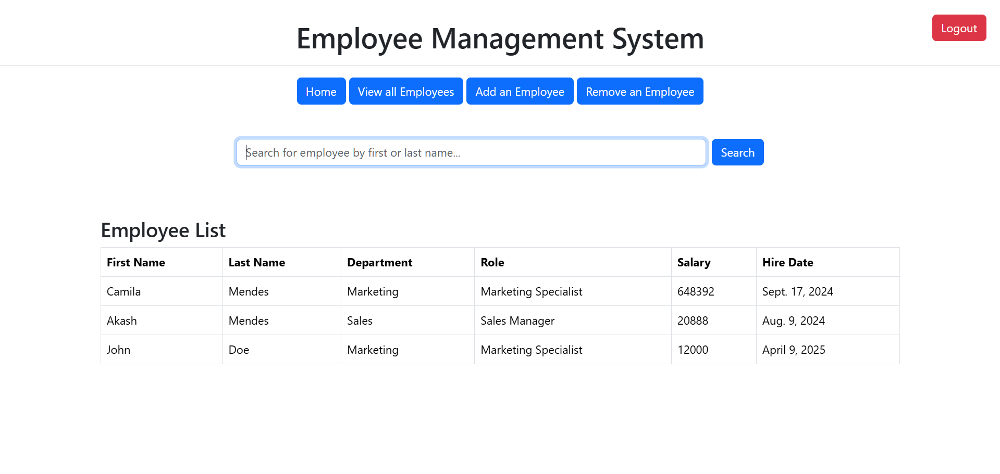
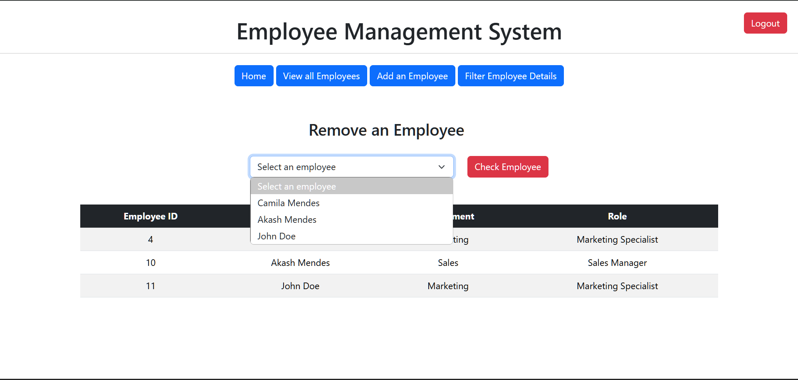

# Employee Management System 🏢



A modern web-based Employee Management System built with Django that allows organizations to efficiently manage their employee data, roles, and departments.

## ✨ Features

- 👥 **User Authentication**
  - Secure login and registration system
  - Role-based access control (Admin/Regular User)

- 👨‍💼 **Employee Management**
  - View all employees in a clean tabular format
  - Add new employees with detailed information
  - Remove existing employees
  - Filter and search employees by name

- 🏢 **Department & Role Management**
  - Organize employees by departments
  - Assign specific roles to employees
  - Track department locations


## 🛠️ Tech Stack

- **Backend**: Django 5.1.1
- **Frontend**: 
  - HTML5
  - Bootstrap 5.3.3
  - JavaScript
- **Database**: SQLite3
- **Authentication**: Django Auth System

## Getting Started

1. **Clone the repository**
```bash
git clone https://github.com/yourusername/Employee_Management_System_Django.git
cd Employee_Management_System_Django
```

2. **Set up virtual environment**
```bash
python -m venv env
source env/bin/activate  # For Unix
env\Scripts\activate     # For Windows
```

3. **Install dependencies**
```bash
pip install -r requirements.txt
```

4. **Run migrations**
```bash
python manage.py makemigrations
python manage.py migrate
```

5. **Create superuser**
```bash
python manage.py createsuperuser
```

6. **Run the development server**
```bash
python manage.py runserver
```

7. Visit `http://localhost:8000` in your browser

## 📱 Screenshots



## 🔐 Security Features

- CSRF protection enabled
- User authentication required for all operations
- Admin-only access for sensitive operations
- Secure password hashing


## 💡 Future Enhancements

- Export employee data to CSV/PDF
- Employee attendance tracking
- Leave management system
- Performance evaluation system
- Email notifications

## 🤝 Contributing

1. Fork the repository
2. Create your feature branch (`git checkout -b feature/AmazingFeature`)
3. Commit your changes (`git commit -m 'Add some AmazingFeature'`)
4. Push to the branch (`git push origin feature/AmazingFeature`)
5. Open a Pull Request
